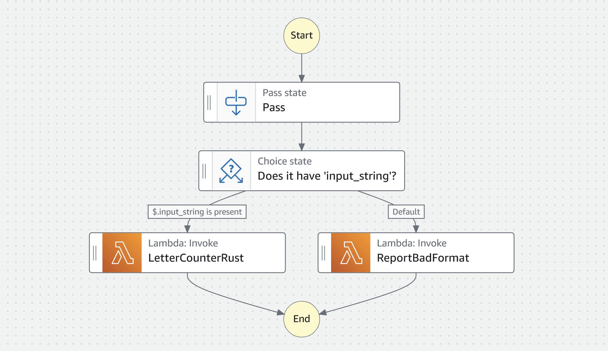
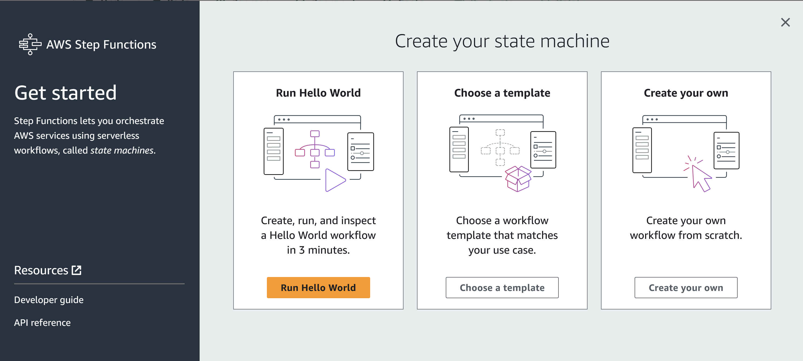
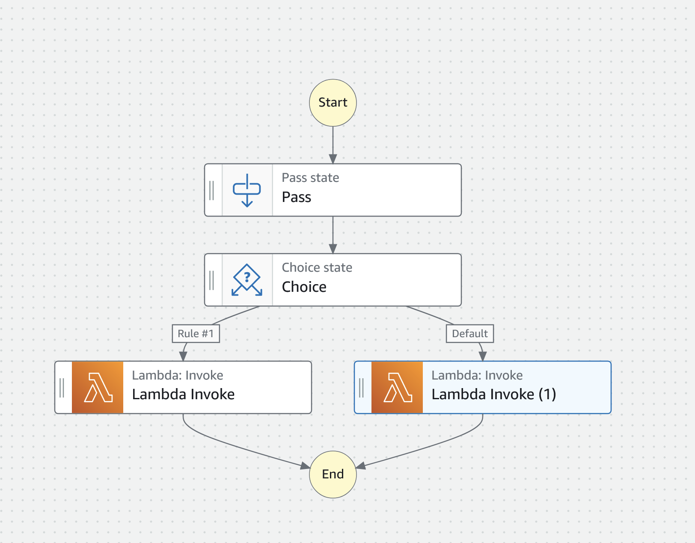
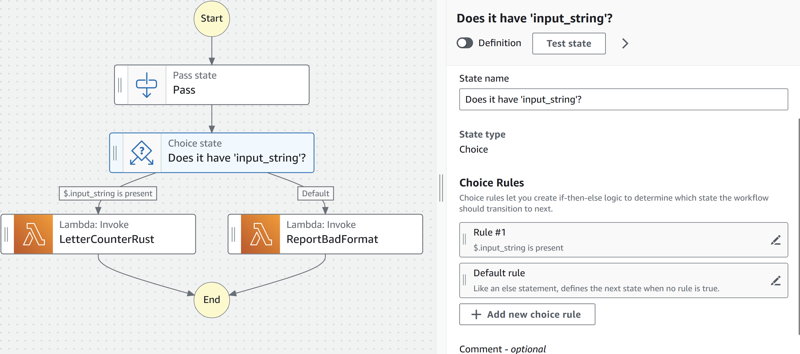
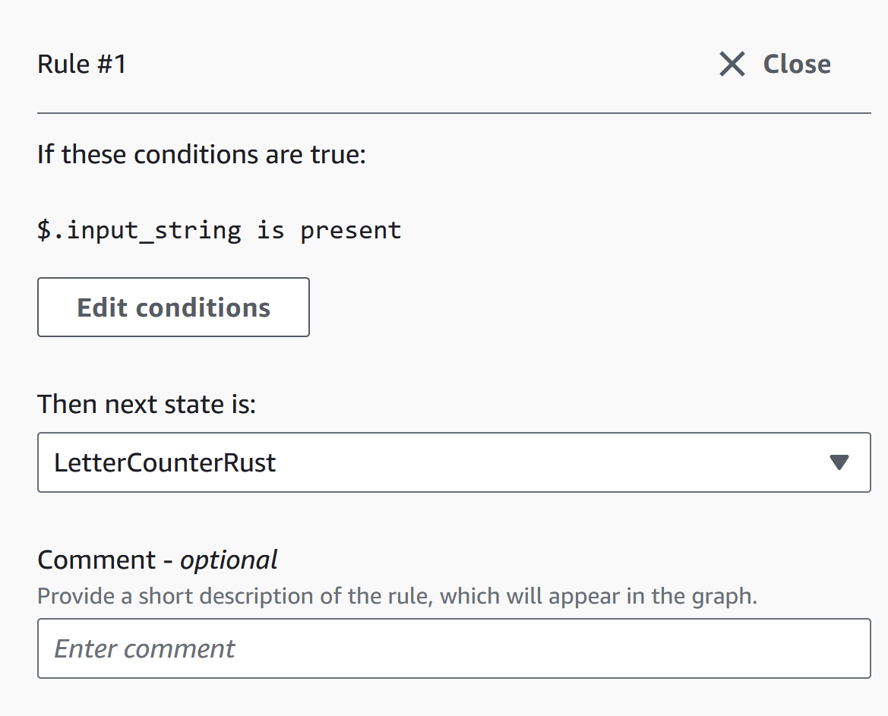
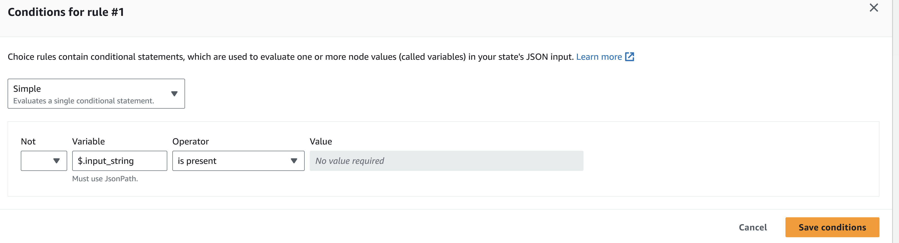
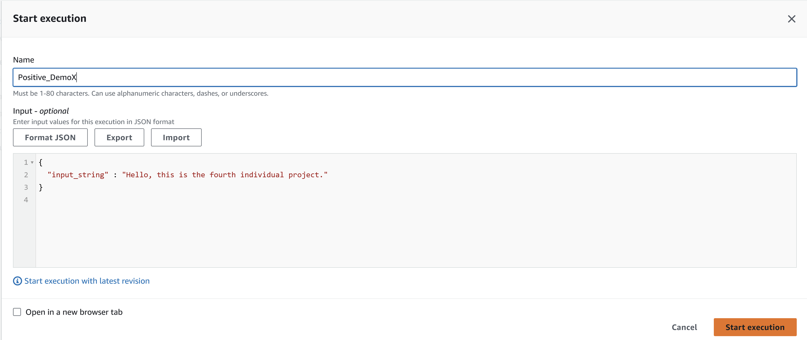
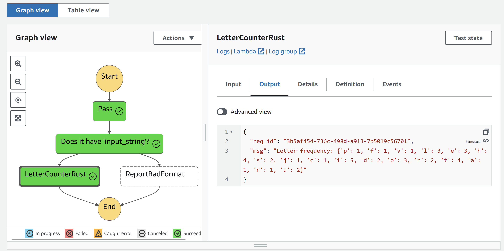
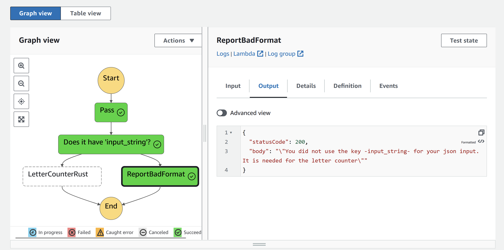
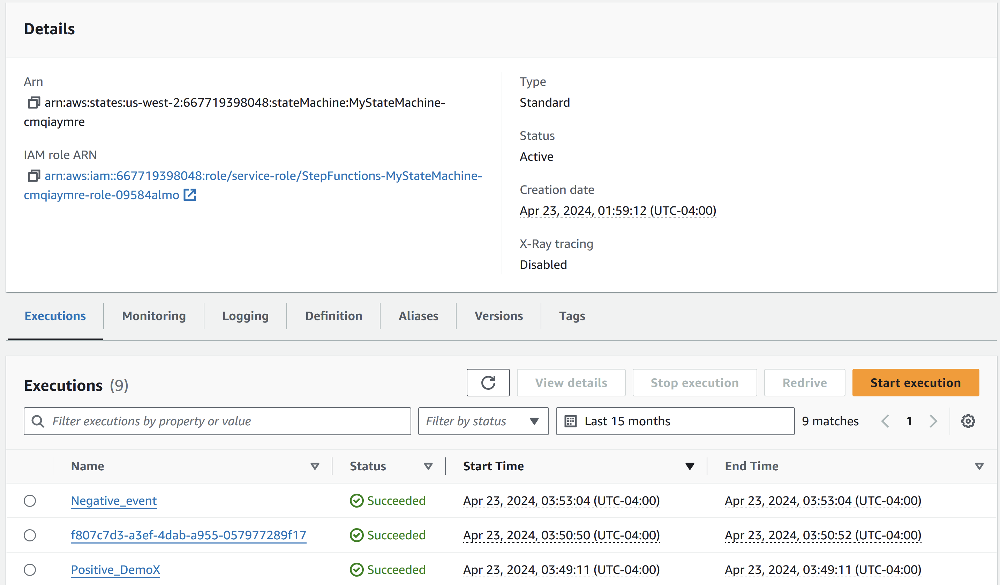

# Step Functions with AWS Lambda

Cloud Computing : Individual Project 4

## Description
In this project, we coordinate AWS step functions leveraging AWS Lambda. An event is sent through a pipeline and then processed accordingly, resulting in either a valid output or a message telling the user to revise the input. 

[Click Here for this Project's Overview Demo Video!!!](https://youtu.be/0wCvsfkFGwY)

## Why do this orchestration for Step Functions?

I needed a simple toy example to learn how to use step functions with AWS Lambda. The letter counter lambda was made in a prior project, whereas the script for reporting the user error was made for this project. 

## Diagram of Step Function Workflow

The event is triggered, which carries a payload. It goes through the pass state in this diagram, which does nothing in this specific instance. The payload is then passed through a choice mechanism, which checks if a condition is satisfied. For the condition, if the json contains "input_string" as a key, it is then processed by the letter_counter rust script, which returns the letter counts in the value associated with that key. This script has been uploaded in this repository for reference, but was originally designed and deployed by me in this [link](https://gitlab.com/ers401S/cargo-lambda-aws-demo). If the key is not in the payload, a python script, uploaded here, is activated, which tells the user to format their test event in the correct format. For details on how to set the project up, look into the rest of this README.




## Setup : Pre-requisites
For those not using the AWS Cloud 9 environment, the required setup will be installing the following:

* AWS cli (the most recent version)

* Deploy your AWS Lambda functions of interest (out-of-scope for this guide).

## Setup Instructions

1. Deploy your Lambda functions. My [letter counter](https://gitlab.com/ers401S/cargo-lambda-aws-demo) was already completed, so I added this script to report an stdout message indicative of an error to the user. For the rest of the steps, we will continue to teach how to setup a workflow with step functions.
```
import json

def lambda_handler(event, context):
    # TODO implement
    
    assert("input_string" not in event)
    
    message = "You did not use the key -input_string- for your json input. It is needed for the letter counter"
        
    
    return {
        'statusCode': 200,
        'body': json.dumps(message)
    }
```

2. Create a template from scratch.



3. Orchestrate a pass and choice state to get you started. Add your Lambdas with the Invoke type under the choices. 



4. I gave all of the steps titles, but the issue was fixing the choice mechanism. The special trick, for my use case, was simply detecting if a payload had the key "input_string". If it did, follow the pipeline to the first lambda. If not, go to the second. for that, I modified the choice in the following manner. I simply checked if the "$.input_string" (in the format of $.key_in_payload) was "is present" in the payload.







5. Then I hit save and/or Execute. Then I proceeded to create test events for both cases.
```
# Positive Event
{
  "input_string" : "Hello, this is the fourth individual project."
}
# Negative Event
{
  "wrong_input_key" : "Hello, this is a wrong input key"
}
```
7. I executed the events in the following manner, after hitting execute.



8. Then I checked the outputs and the pipelines. Here are the results for the input json.

Positive Event:



Negative Event:



If you go to the state machine page, you can see the list of all events:



## Results

Once again, here is the data pipeline with the workflow diagram as well, as well as the example input events that I used.

Step Functions Workflow:


Positive Event:


Negative Event:


## Licenses
Creative Commons.

## Status
This project is complete as of April 2024.